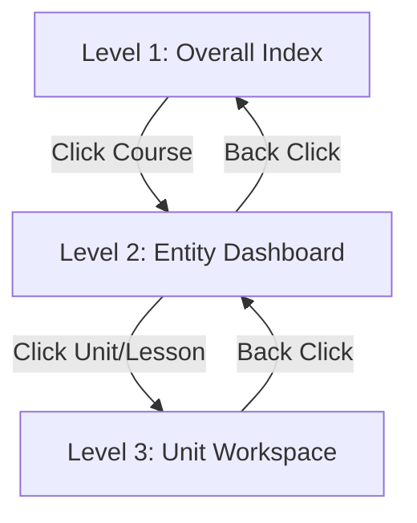

# Frontend Architecture & Mock API Reference

This document details the frontend architecture standards, Component-Driven Design (CDD) practices, mock API simulation protocols, and the multi-level UI flow implemented across Mastery Academy.

---

## 1. Component-Driven Design (CDD) for Dashboards

Complex dashboards must be built bottom-up to prevent monolithic, unmaintainable components.

### 1.1 Atomic Component Hierarchy
* **Atoms (Primitives)**: Reusable components with no external dependencies (e.g., `GoldButton`, `StatusBadge`, `GoldProgressBar`).
* **Molecules (Combinations)**: Simple compositions of atoms (e.g., a card containing a metric number and progress indicator, a list item containing an avatar and status indicator).
* **Organisms (Workspaces & Widgets)**: High-level functional modules (e.g., `QuizBuilder`, `TimelineChapters`, `RegisteredStudentsTable`).
* **Templates & Pages (Views)**: The final assembly binding states and route scopes (e.g., `instructor.courses.tsx`).

### 1.2 State Isolation
* Presentational components should be pure and receive callbacks (`onClick`, `onChange`, `onSubmit`).
* Complex states (such as authentication or global preferences) must be managed using **Zustand stores** or **React Router search params**.
* UI-only state (e.g., active tabs, accordion collapses, modal toggles) should use standard local `useState` hooks.

---

## 2. API-First Design & Mock Data Simulation

All features must follow an **API-first contract** using mock data that mimics real backend communication.

### 2.1 API Contract & TypeScript Types
Define the data structures and TypeScript interfaces *before* building the UI:
```typescript
// Define explicit interfaces in data/mock/types.ts
export interface LessonEdit {
  id: string;
  title: string;
  duration: string;
  video: string;
  instructions: string;
  assignment: string;
}
```

### 2.2 Seeding Mock Data
Store all mock data inside `src/data/mock/` as exportable, editable state objects.

### 2.3 Simulating Network Mutations
When performing state mutations (creation, updates, deletions):
1. Use local state hook arrays initialized from the mock database.
2. Trigger success/error visual indicators using toast notifications (`toast.success` / `toast.error`).
3. Maintain mock mutations within the user session.

*Example pattern for mock API mutations:*
```typescript
const handleAddLesson = () => {
  const newLesson: LessonEdit = {
    id: `l${Date.now()}`,
    title: "درس جديد غير معنون",
    duration: "00:00",
    video: "lesson_new.mp4",
    instructions: "",
    assignment: ""
  };
  setSyllabus((prev) => [...prev, newLesson]);
  toast.success("تم إضافة درس جديد للمنهج الدراسي ✓");
};
```

---

## 3. Multi-Level Frontend Flows (Case Study)

For complex features like course management, follow the **three-level drill-down state machine** implemented in [instructor.courses.tsx](file:///mnt/sda2/repos/platform-insights/src/routes/instructor.courses.tsx):



### 3.1 Level 1: Overall index & Global Analytics
* **Purpose**: Show aggregations and entry points.
* **UI Structure**:
  * Row of overall summary cards (total users, active counters, revenue, metrics).
  * Main data table of entities (e.g., courses) with edit triggers.
* **State Trigger**:
  * Set `manageCourseId(null)` and `selectedLessonId(null)`.

### 3.2 Level 2: Entity Dashboard & Outline
* **Purpose**: Show statistics, activity logs, and sub-module directory.
* **UI Structure**:
  * Back button to return to Level 1.
  * Stats grid for the specific selected entity.
  * List of modular sub-entities (e.g., syllabus lessons list).
* **State Trigger**:
  * Set `manageCourseId(courseId)` and `selectedLessonId(null)`.

### 3.3 Level 3: Unit Workspace (Full-Width Canvas)
* **Purpose**: Dedicated focus mode for editing a single sub-unit.
* **UI Structure**:
  * Breadcrumb header (`Course Title > Lesson Title`) and back button to Level 2.
  * Full-width tabs layout containing the workspace editor.
  * Integration of preview panels (e.g., video preview player) and control variables in the same view.
* **State Trigger**:
  * Set `manageCourseId(courseId)` and `selectedLessonId(lessonId)`.
